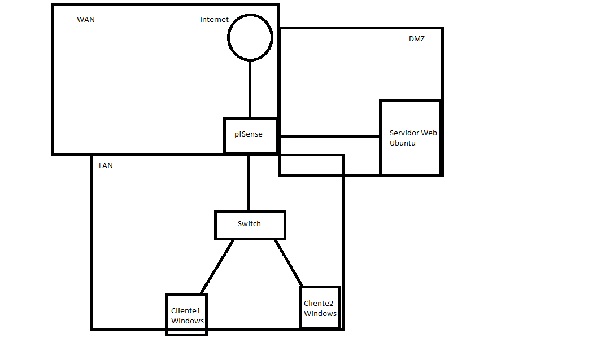

# pfSense
Soy Óscar Avecilla Barrios, alumno de 2º de ASIR del instituto I.E.S. Rodrigo Caro y este es mi proyecto de final de FP.

## Esquema
Voy a implmentar el siguiente esquema de red con pfSense, añadiendo algunas reglas y servicios de los que poseemos gracias a esta herramienta, aparte de una explicación de las funciones de pfSense.

## Índice

- I. Introducción a pfSense
  - A. [¿Qué es pfSense?](apartados/quees.md)
  - B. [Ventajas principales](apartados/ventajas.md)
  
- II. Arquitectura de pfSense
  - A. [Requisitos del sistema](apartados/requisitos.md)
  - B. [Opciones de instalación](apartados/opciones.md)
  
- III. Configuración inicial de pfSense
  - A. [Descarga e instalación de pfSense](apartados/instalacion.md)
  - B. [Configuración básica del sistema](apartados/conf.md)
  - C. [Acceso a la interfaz web de administración](apartados/web.md)
  
- IV. Interfaces y configuración de red
  - A. [Tipos de interfaces de red soportadas](apartados/interfaces.md)
  - B. [Configuración de interfaces WAN, LAN y DMZ](apartados/confint.md)
  - C. [DHCP](apartados/dhcp.md)
  
- V. Seguridad y cortafuegos
   - A. [Configuración del cortafuegos](apartados/confcorta.md)
   - B. [Reglas aplicadas](apartados/aplicadas.md)
   
- VI. Actualizaciones y mantenimiento
   - A. [Respaldo y restauración de configuraciones](apartados/backup.md)
    
- VII. Conclusiones
   - A. [Resumen de los principales puntos cubiertos](apartados/resumen.md)
   - B. [Ventajas y desventajas de pfSense](apartados/ventajasydesventajas.md)
   - C. [Conclusiones](apartados/conclusion.md)
